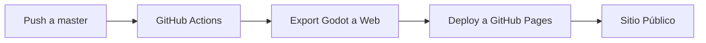

# 🚀 Guía de Setup - GitHub Pages Deployment

## Paso 1: Subir el Código a GitHub

### Opción A: Usando Git en PowerShell

```bash
# Navega a tu proyecto
cd C:\Users\juanm\OneDrive\Escritorio\3DAIRE

# Inicializa Git (si no está inicializado)
git init

# Agrega todos los archivos
git add .

# Haz commit de los cambios
git commit -m "Add GitHub Actions workflow for auto-deployment"

# Conecta con tu repositorio en GitHub (reemplaza la URL)
git remote add origin https://github.com/manuavalos-git/3DAIRE.git

# Si ya existe el remote, actualízalo:
# git remote set-url origin https://github.com/manuavalos-git/3DAIRE.git

# Cambia a la rama master
git branch -M master

# Push a GitHub
git push -u origin master
```

### Opción B: Usando GitHub Desktop

1. Abre GitHub Desktop
2. File → Add Local Repository
3. Selecciona la carpeta `3DAIRE`
4. Commit los cambios
5. Publish repository

## Paso 2: Configurar GitHub Pages

1. Ve a tu repositorio: https://github.com/manuavalos-git/3DAIRE
2. Click en **Settings** (Configuración)
3. En el menú lateral, click en **Pages**
4. En **Source**, selecciona: **GitHub Actions**
5. Guarda los cambios


## Paso 3: Activar GitHub Actions

1. Ve a la pestaña **Actions** en tu repositorio
2. Si aparece un mensaje para habilitar workflows, click en **Enable**
3. El workflow se ejecutará automáticamente

## Paso 4: Verificar el Deployment

1. Ve a: **Actions** → Click en el workflow más reciente
2. Espera a que termine (aproximadamente 3-5 minutos)
3. Una vez completado, tu sitio estará en:
   ```
   https://manuavalos-git.github.io/3DAIRE/
   ```

## 🎯 Workflow del Proceso



## 🔄 Para Futuros Deployments

Cada vez que hagas cambios:

```bash
# Haz cambios en tu código
# Luego:

git add .
git commit -m "Descripción de los cambios"
git push origin master

# ¡Eso es todo! GitHub Actions hará el resto automáticamente
```

## 📋 Checklist de Verificación

- [ ] Código subido a GitHub
- [ ] GitHub Pages configurado con "GitHub Actions"
- [ ] Workflow ejecutado exitosamente (sin errores rojos)
- [ ] Sitio web accesible en la URL de GitHub Pages
- [ ] Controles de cámara funcionan en web
- [ ] Chat se ve correctamente

## ⚠️ Problemas Comunes

### Error: "No export preset found"

**Solución**: Asegúrate de que `export_presets.cfg` está en el repositorio:
```bash
git add export_presets.cfg
git commit -m "Add export presets"
git push
```

### Error: "Permission denied"

**Solución**: Ve a **Settings** → **Actions** → **General** → **Workflow permissions** → Selecciona "Read and write permissions"

### Error: "404 Page Not Found"

**Solución**: 
1. Espera 5 minutos (GitHub Pages puede tardar)
2. Verifica que el deployment terminó correctamente en Actions
3. Revisa que la URL sea: `https://TU_USUARIO.github.io/3DAIRE/` (con mayúsculas si tu repo las tiene)

### El sitio no carga los archivos .wasm o .pck

**Solución**: Los headers CORS ya están configurados en el workflow. Si sigue fallando:
1. Verifica en las DevTools del navegador (F12)
2. Revisa los headers en la pestaña Network
3. Asegúrate de que los archivos se desplegaron correctamente

## 🔐 Proteger la API Key (Opcional pero Recomendado)

Para no exponer tu API key de Gemini en el código público:

1. Ve a **Settings** → **Secrets and variables** → **Actions**
2. Click en **New repository secret**
3. Name: `GEMINI_API_KEY`
4. Value: Tu API key actual
5. Click **Add secret**

Luego modifica el código para usar la variable de entorno en lugar de hardcodear la key.

## 📊 Monitoreo

Puedes ver el estado del deployment en cualquier momento:
- Badge en el README muestra el estado
- Pestaña Actions muestra el historial de deployments
- GitHub Pages settings muestra la última URL desplegada

## 🎉 ¡Listo!

Una vez configurado, cada commit a `master` desplegará automáticamente tu simulador. 

**URL de tu sitio**: https://manuavalos-git.github.io/3DAIRE/

---

¿Necesitas ayuda? Revisa los logs en la pestaña **Actions** de GitHub.
